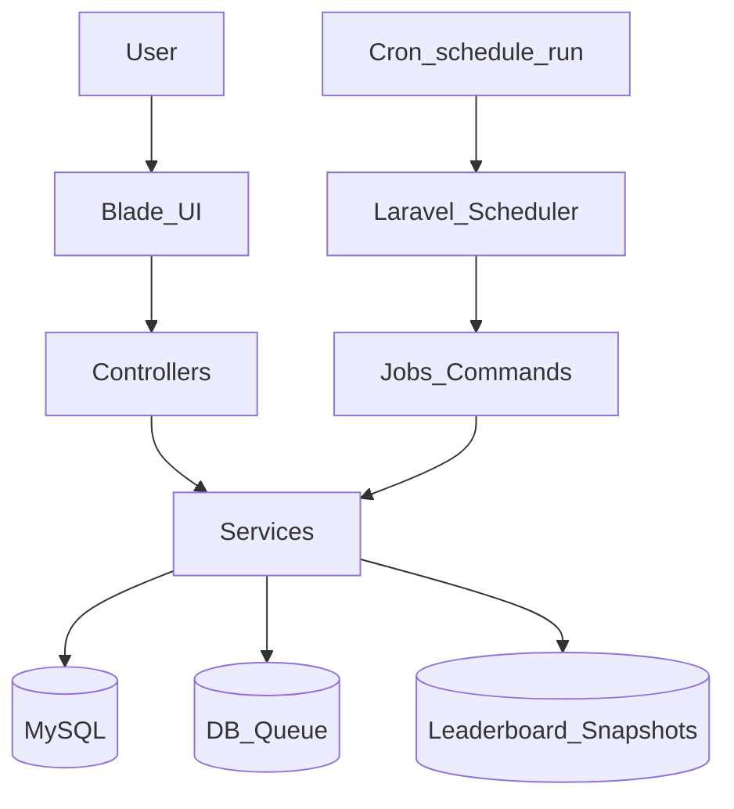

# Laravel cPanel Soru Bankası — Tek Master Plan (Paylaşımlı Hosting Uyumlu)

Bu dosya, klasördeki üç kaynağı (v2 iyileştirilmiş plan + v3 “AI uyumlu plan” + cPanel optimized guide) **tek bir “master plan”** altında birleştirir ve özellikle **paylaşımlı (shared) cPanel hosting** kısıtlarına göre tasarlanmıştır.

Amaç: Laravel ile **soru bankası + test motoru + moderasyon + leaderboard + import** özelliklerini, Redis olmadan, tek sunucuda, cron/DB queue ile **sorunsuz** çalışacak şekilde üretmek ve yayına almak.

---

## 1) Hosting gerçekleri ve tasarım ilkeleri (cPanel/shared)

### 1.1 Kısıtlar (planın temelini belirler)
- **Redis yok**: queue/caching Redis’e bağlanmayacak; `file cache` + `database queue`.
- **Cron çözünürlüğü**: genelde **5 dakikada bir** (daha sık izin verilmeyebilir).
- **Uzun yaşayan worker yok varsayımı**: `queue:work` 7/24 çalışmayabilir; bunun yerine **kısa süreli çalıştır** yaklaşımı.
- **MySQL 5.7+**, PHP 8.1/8.2 (hosting değişken).
- **Kaynak sınırlı**: ağır aggregation’lar “snapshot” modeline alınacak, sayfalama zorunlu olacak.

### 1.2 “Shared hostingte en sağlam” mimari seçim
- **Laravel 10 LTS** (cPanel uyum açısından en güvenli default).
- **Monolith + Blade + Bootstrap**: SPA yok (deploy/asset build bağımlılıklarını minimumda tutar).
- **DB snapshot tabanlı leaderboard**: runtime’da ağır hesap yok.
- **Preview/Confirm import**: “yanlış import” geri dönüşü zor olduğu için iki aşamalı akış şart.
- **Transaction odaklı test bitirme**: skor + stats güncelleme + counters birlikte ve atomik.

---

## 2) Ürün kuralları (Scope Freeze v1) — kesin gereksinimler

### 2.1 Roller
- **Admin**: tüm yetkiler (kullanıcı/rol, ayarlar, rollback, audit log, yedek).
- **Editor**: soru yönetimi, kullanıcı sorusu onay/red, import manual-review, kalite kuyruğu.
- **User**: test çözme, soru gönderme, kendi istatistikleri, leaderboard.

### 2.2 Test kuralları
- Test: **20 soru / 30 dakika**
- Soru tipi: **5 şıklı (A–E)**, tüm şıklar zorunlu
- Puan: Doğru **+5**, yanlış/boş **0**, max **100**
- Bir kullanıcı aynı anda **tek aktif test**: yeni test isteği `409 active_test_exists`
- Dersin onaylı soru sayısı < 20 ise test başlatılmaz: `422 insufficient_questions`

### 2.3 Feedback mode (mutually exclusive)
Admin sadece **birini** seçer:
- `DELAYED_FEEDBACK` (default): test sırasında feedback yok, cevap değişebilir; bitince detaylı inceleme var
- `INSTANT_FEEDBACK_LOCKED`: cevap anında doğru/yanlış göster; **kilitle**, değiştirilemez
- `NO_FEEDBACK`: sonuçta bile doğru/yanlış gösterme; sadece puan/istatistik

### 2.4 Test modları (3 mod)
- **Random**: ders havuzundan rasgele 20, tekrar olabilir
- **Difficulty Range**: kullanıcı min/max seçer (1–10), aralıktan topla; yetmezse dersten tamamla
- **Takıldıklarım** (yanlışlardan) + kesin fallback:
  - 72 saat “cooldown” yalnız bu modda geçerli
  - Yetmezse cooldown 48 → 24 → 0 saat olarak kademeli düşer
  - Hâlâ 20 olmazsa `422 mode_pool_insufficient`
  - Rastgele tamamlandıysa kullanıcıya bilgi: “X soru rastgele eklendi”

### 2.5 Leaderboard kuralları
- Global leaderboard: son 30 günde **min 3 geçerli test**
- Ders leaderboard: o derste son 30 günde **min 3 geçerli test**
- “Geçerli test” tanımı:
  - `status=finished`, `question_count=20`, `duration_minutes<=30`, `aborted=false`
- Tie-breaker sırası:
  1) skor desc
  2) wrong_count asc
  3) finished_at asc
  4) created_at asc

### 2.6 Kullanıcı soru önerisi ve ödül (+10)
- Kullanıcı sorusu `pending` olarak alınır → Editor/Admin inceler
- Onaylanan soru: **+10 puan**
- Sonradan sorun çıkarsa: soru reddedilir, verilen **+10 geri alınır**, audit log yazılır
- Günlük kullanıcı soru limiti: **20**

### 2.7 Import kuralları (CSV/XLSX)
- Dosya limiti: **20 MB**, satır limiti: **1000**
- Idempotency hash:
  - `question_hash = MD5(TRIM(CONCAT(subject_id, LOWER(question_text))))`
- Çakışmada seçenek: `SKIP | MERGE | MANUAL_REVIEW`
- Mutlaka: **Preview → Confirm** (confirm olmadan DB’ye yazma)

---

## 3) Proje iskeleti ve klasör yapısı (önerilen)

### 3.1 Başlangıç paketleri
- Auth: **Laravel Breeze (Blade)** (lightweight)
- UI: Bootstrap 5 (CDN veya minimal build)

### 3.2 Önerilen dizinleme
- `app/Http/Controllers/` (thin controllers)
- `app/Services/` (iş kuralları burada)
- `app/Policies/` (RBAC)
- `app/Console/Commands/` (cron tetiklenen işler)
- `app/Jobs/` (DB queue job’ları — ama shared hostingte kısa çalıştır)
- `database/migrations/`, `database/seeders/`
- `resources/views/` (user + admin/editor)

---

## 4) Veri modeli (migration sırası ve kritik indeksler)

Bu bölüm “en ince detay” için **sıra + amaç + indeks** düzeyinde yazıldı. Migration isimleri kronolojik tutulacak.

### 4.1 Migration sırası (öneri)
1) `roles`, `users` (email verify alanı dahil)
2) `subjects`
3) `questions` (+ indeksler)
4) `tests`, `test_items`
5) `user_subject_stats` (unique `(user_id, subject_id)`)
6) `user_wrong_question_stats` (unique `(user_id, question_id)`)
7) `user_recent_question_history` (Takıldıklarım cooldown kontrolü)
8) `leaderboard_global_snapshots`, `leaderboard_subject_snapshots`
9) `settings` (typed key/value)
10) `audit_logs`
11) `failed_login_attempts`
12) `user_submitted_questions`
13) `question_versions`
14) Import: `question_import_batches`, `question_import_rows`, `question_import_errors`
15) (P1) `question_reports`, `question_difficulty_ratings` — v1 dışı bırakılabilir

### 4.2 İndeks zorunluları (paylaşımlı host için şart)
- `questions(subject_id, status)`
- `questions(difficulty_score)`
- `tests(user_id, status)`
- `tests(user_id, created_at)`
- `test_items(test_id)`
- `test_items(question_id)`
- `user_wrong_question_stats(user_id, wrong_count)`
- `user_recent_question_history(user_id, last_answered_at)`
- `leaderboard_*_snapshots(snapshot_at)` ve ilgili FK indeksleri
- `audit_logs(actor_id, created_at)`

---

## 5) Domain servisleri (hangi servis ne yapacak?)

### 5.1 Settings ve feature flags
`SettingsService`:
- `test_feedback_mode`
- `registration_open`
- `daily_test_limit` (default 20)
- `login_rate_limit` (default 5)
- `login_lockout_duration` (default 900s)
- `minimum_leaderboard_tests` (default 3)
- `maintenance_mode`
- `backup_mode` (manual/automatic)

Kritik ayarlar değişince:
- Admin şifre re-check (10 dk TTL)
- `audit_logs` kaydı (old/new)

### 5.2 Test akışı
`TestGenerationService`:
- subject + mode’a göre 20 soruyu seçer
- Takıldıklarım fallback algoritmasını **birebir** uygular

`AnswerEvaluationService`:
- answer kaydı
- feedback mode’a göre:
  - instant modda doğru/yanlış hesaplar, explanation döndürür ve kilitler
  - delayed modda sadece seçim kaydı (değişebilir)

`TestFinalizeService`:
- finish ile skor hesaplar
- blank_count dahil
- transaction içinde:
  - `tests` update (score, counts, status)
  - `test_items` awarded_points/is_correct
  - question counters (correct_count/wrong_count)
  - `user_subject_stats` güncelle
  - `user_wrong_question_stats` güncelle
  - `user_recent_question_history` güncelle

### 5.3 Leaderboard
`LeaderboardEligibilityService`:
- “son 30 gün / min 3 geçerli test” filtresi

`LeaderboardSnapshotService`:
- global + subject snapshot’ı hesaplar
- sonuçları snapshot tablolarına yazar
- idempotent çalışma: aynı `snapshot_at` için overwrite/replace stratejisi

### 5.4 Import
`QuestionImportService` (iki aşama):
- Upload → parse/validate → preview üret
- Confirm → aksiyonlara göre insert/merge/manual_review kayıtları

`ImportDedupService`:
- hash hesaplar
- çakışma yönetimini standartlaştırır

### 5.5 Moderasyon (+10 puan)
`SubmissionModerationService`:
- pending submissions kuyruğu
- approve/reject akışı (reject için reason zorunlu)

`ContributionRewardService`:
- approve → +10
- revoke → -10 (audit log zorunlu)

---

## 6) Route/Endpoint planı (web + gerekli yerlerde JSON)

### 6.1 Kullanıcı akışları
- Ders listesi
- Test başlat (mode + difficulty range)
- Test ekranı (answer post)
- Test finish
- Test review (sonuç detay)
- Profil istatistikleri
- Leaderboard (snapshot)

### 6.2 Admin/Editor akışları
- Ders CRUD
- Soru CRUD + version history
- Kullanıcı soruları kuyruğu (approve/reject)
- Import: upload → preview → confirm
- Ayarlar (kritik ayar şifre re-check)
- Audit log listeleme/filtre

---

## 7) UI/UX detay planı (Blade + Bootstrap)

### 7.1 Test çözüm ekranı
- 1 soru/sayfa, ileri/geri
- Sticky sayaç “Kalan: MM:SS”
- Yazı boyutu seçimi (küçük/orta/büyük) → localStorage
- Instant modda: doğru/yanlış renk + ikon + açıklama; seçenek disabled
- Delayed modda: sadece seçili seçenek highlight; açıklama yok

### 7.2 Sonuç ekranı
- Puan (X/100)
- doğru/yanlış/boş sayıları + yüzdeler
- her soru için: user_answer + correct_answer + explanation (mode’a göre)
- boş cevap “BOŞBIRAKILDI”

### 7.3 Leaderboard ekranı
- Sekmeler: Global + Ders seçimi
- Tablo: rank, ad, puan, son test tarihi
- Pagination (top 100)

---

## 8) Async/Cron/Queue (shared hostingte kesin çalışan kurgu)

### 8.1 .env defaults (cPanel)
- `CACHE_DRIVER=file`
- `QUEUE_CONNECTION=database`
- `SESSION_DRIVER=cookie` (veya `file`)

### 8.2 Cron stratejisi (tek giriş noktası)
- cPanel cron:
  - `*/5 * * * * cd /home/USER/app && php artisan schedule:run >> /dev/null 2>&1`

### 8.3 Scheduler içinde planlanan işler
- 5 dk: Leaderboard snapshot (komut veya job)
- 5 dk: kısa queue runner (varsa bekleyen işler) `queue:work --once --max-jobs=10`
- günlük 02:00: audit log cleanup (90 gün)
- opsiyonel: günlük DB backup (feature flag)

Not: shared hostingte “schedule:run” 5 dk çalıştığı için, 1 dk hassasiyet beklenmez. Bu nedenle leaderboard “yaklaşık” güncel olur; ürün kuralı olarak kabul edilir.

---

## 9) Güvenlik planı (uygulanabilir maddeler)

### 9.1 Auth
- Email verification zorunlu (test başlatmaya engel)
- Rate limit: 5/15 dk → 15 dk lockout (`failed_login_attempts`)

### 9.2 Input güvenliği
- Blade escaping default
- Import ve user-submission metinlerinde whitelist sanitization (HTML tag yok)

### 9.3 Audit log
- Kritik işlemler: approve/reject, settings change, rollback, reward revoke
- Retention: 90 gün (cron ile temizle)

### 9.4 .env korunumu
- En iyi: `.env` public root dışında
- Değilse: `.htaccess` ile `.env` ve dotfile engelleme

---

## 10) cPanel deploy planı (adım adım)

### 10.1 Ön koşullar (hosting panel)
- PHP 8.1/8.2 seç (MultiPHP)
- MySQL DB + kullanıcı oluştur
- SSL (AutoSSL) aktif
- Cron erişimi var

### 10.2 Dizin yerleşimi (iki senaryo)
Senaryo A (en güvenli):
- Kod: `/home/USER/soru-bankasi`
- Public: `/home/USER/public_html` sadece `public/` içeriği

Senaryo B (hosting kısıtı):
- Kod: `/home/USER/public_html/soru-bankasi`
- `public_html/.htaccess` ile `/soru-bankasi/public` yönlendirmesi

### 10.3 Kurulum komut sırası
- `composer install --no-dev --optimize-autoloader`
- `.env` oluştur (DB bilgileri, cache/queue ayarları)
- `php artisan key:generate`
- `php artisan migrate --force`
- `php artisan db:seed` (admin/editor/user seed)
- `php artisan config:cache && php artisan route:cache && php artisan view:cache`
- `chmod -R 775 storage bootstrap/cache`
- `php artisan storage:link` (gerekiyorsa)

### 10.4 Cron ekleme
- `*/5 * * * * cd ... && php artisan schedule:run >> /dev/null 2>&1`

---

## 11) Test planı (minimum “production-ready” kontrol)

### 11.1 Unit test öncelikleri
- Puanlama + blank_count
- Takıldıklarım fallback adımları
- Leaderboard eligibility + tie-breaker
- Import hash/idempotency (skip/merge)
- Difficulty score formülü

### 11.2 Feature test öncelikleri
- Register → verify email → start test
- Active test guard (409)
- Finish → stats update
- Submission approve → +10, revoke → -10
- Import preview → confirm

### 11.3 Smoke checklist (deploy sonrası)
- Login/Logout
- Ders listesi
- Test başlat/bitir
- Leaderboard açılıyor (snapshot var)
- Cron çalışıyor mu (log)

---

## 12) Uygulama geliştirme sırası (en doğru iş planı)

### Faz 0 — Temel iskelet (proje + auth + rol)
- Laravel kurulum + Breeze (Blade)
- roles/users + seed
- RBAC (Policy/Gate)
- Settings altyapısı + kritik ayar şifre re-check

### Faz 1 — Çekirdek içerik (ders + soru)
- subjects CRUD
- questions CRUD + status + validation
- indeksler ve temel sorgular

### Faz 2 — Test motoru
- tests/test_items
- start/answer/finish
- timer mantığı (server time)
- feedback mode davranışları
- stats tabloları güncelleme

### Faz 3 — Leaderboard snapshot
- eligibility + tie-breaker
- snapshot tabloları
- `LeaderboardSnapshotCommand` + scheduler
- leaderboard UI

### Faz 4 — Moderasyon + import
- user_submitted_questions + approve/reject
- +10 reward + reversal + audit log
- import upload/preview/confirm + idempotency + manual review kuyruğu

### Faz 5 — Sertleştirme (shared hosting)
- query optimizasyonu + pagination zorunluluğu
- cache TTL stratejisi (file cache)
- cron/schedule doğrulama
- deploy dokümanı + smoke checklist

---

## 13) Paylaşımlı hosting için ekstra öneriler (pratik)
- Leaderboard hesaplarını “tek SQL ile” minimize et; snapshot tablosuna yaz ve UI sadece onu okusun.
- Admin listelerinde tarih filtresi + pagination zorunlu olsun (tek seferde 10k satır çekme).
- Import işlemini chunk’lara böl: confirm sonrası 1000 satırı tek requestte işlemek yerine queue/cron ile parça parça ilerlet.

